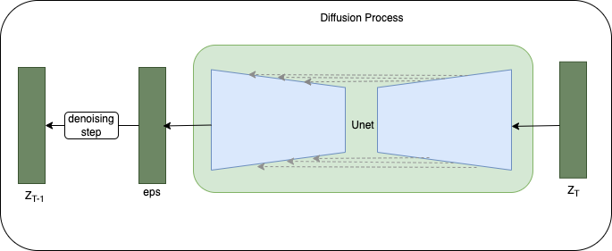
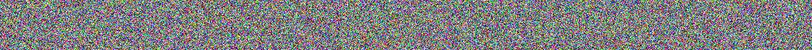
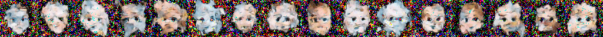
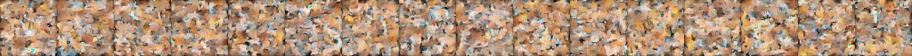
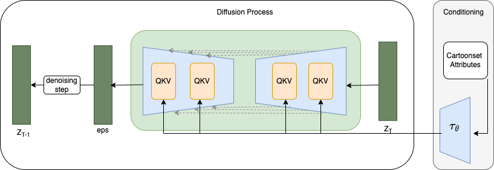
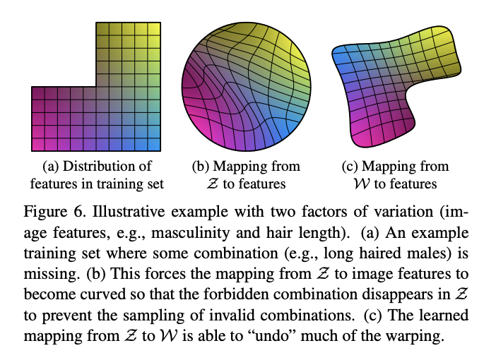
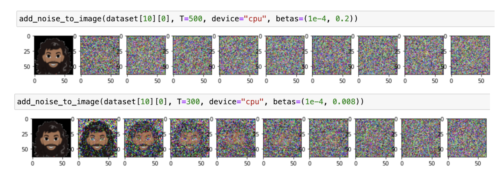
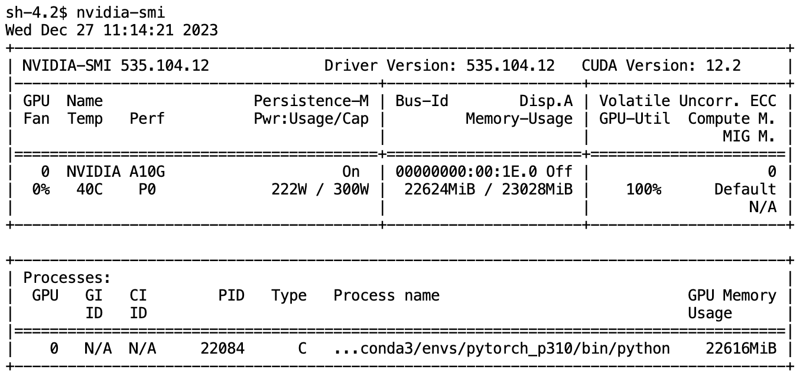

# Build Avatar Diffusion Model from Scratch

  

Diffusion models have garnered significant attention from both the general public and the machine learning community since their introduction. Huggingface provides the diffusers library, enabling developers to swiftly construct diffusion models. Rather than fine-tuning existing models and harnessing the diffuser library, we opted to create a compact diffusion model from scratch. This involved crafting the Unet along with its fundamental components, the diffusion process, and the conditioning module. Due to limited computational resources, we trained the model using a small and straightforward dataset called ["Cartoon Set"](https://google.github.io/cartoonset/download.html). 

The aim of this blog is to delve into the fundamentals of diffusion models via a practical experiment and to share insights gained from training and fine-tuning these models.

[The notebook of this hands-on lab](https://github.com/WuyangLI/ML_sessions/blob/main/diffusion_models/cartoonset_diffusion/cartoonset_diffusion_conditional_v5.ipynb) does conditional image generation on Cartoon Set by a diffusion model.
The code is modified from [cloneofsimo/minDiffusion](https://github.com/cloneofsimo/minDiffusion), [TeaPearce/Conditional_Diffusion_MNIST](https://github.com/TeaPearce/Conditional_Diffusion_MNIST), and [LucasDedieu/Denoising-Diffusion_Model_Flower102](https://github.com/LucasDedieu/Denoising-Diffusion-Model-Flower102/blob/main/diffusion_model.ipynb).

Before getting started with the practical lab, if you're looking to deepen your theoretical understanding of diffusion models, please take a look at the referenced papers.
1. [DDPM](https://arxiv.org/abs/2006.11239)
2. [Classifier-Free Diffusion Guidance](https://arxiv.org/abs/2207.12598)
3. [Photorealistic Text-to-Image Diffusion Models with Deep Language Understanding](https://arxiv.org/abs/2205.11487)

# Dataset and Preprocessing
Cartoon Set is a collection of 2D cartoon avatar images, as illustrated below.

  

This data is licensed by Google LLC under a [Creative Commons Attribution 4.0 International License](http://creativecommons.org/licenses/by/4.0/).
We apply the following preprocessing to images:
1. Central crop 360 pixels
2. Resize to 64 by 64 images
3. Convert int8 to float, in the range of [-1, 1]

The first important takeaway is that adjusting input tensors to the appropriate range significantly speeds up the model's convergence.

As [Djib2011](https://datascience.stackexchange.com/users/34269/djib2011) explained in his answer to the question ["should-input-images-be-normalized-to-1-to-1-or-0-to-1"](https://datascience.stackexchange.com/questions/54296/should-input-images-be-normalized-to-1-to-1-or-0-to-1)

> Theoretically it's better to scale your input to [−1,1] than [0,1] and I'd argue that it's even better to standardize your input (i.e. μ=0, σ=1).
>
>Deep neural networks, especially in their early days, had much trouble with backpropagation, as they suffered from vanishing/exploding gradients. A popular way to combat this is by initializing the weights of the network in smarter ways. Two initialization techniques have proven to be the most popular: Glorot initialization (sometimes referred to as Xavier initialization) and He initialization, both of which are variations of the same idea.
> 
>In order to derive their intialization they make a few assumptions, one of which is that the input features have a zero mean. You can read this post for simplified explanation, but I'd suggest reading the two papers mentioned above.

Initially, I attempted to train a basic diffusion model without any conditions. 

  

In my first trial, I normalized the image tensors to fall within the [0, 1] range. 
However, after the first epoch of training, the model didn't show much learning and generated random noise as output. 

  

It took around 4 epochs for the model to begin generating images that weren't just white noise.

  

Subsequently, when I adjusted the image tensors to the [-1, 1] range, the model started learning the features of avatars more rapidly. The model is able to generate the following samples after training for the first epoch.

  

As seen in figure 4, it took 6 epochs for the model to produce some images resembling faces. 

  

By "epoch 39," the model managed to capture attributes such as skin tone, glasses, eye color, eye shape, and various hairline shapes.

  

However, the model struggled to learn different hairstyles and to paint them in good colors. 
Clearly, the model exhibits a strong bias as it consistently produces images depicting men with a beard and large grey hair around the face. Could this be a case of "mode collapsing," akin to the enigmatic issue encountered in GANs?

In one word, for diffusion models, it's essential that the normalized pixel values fall within the range of [−1,1] because Gaussian noise has zero mean and unit variance. 

# Conditional Diffusion Model
We overcome the "mode collapsing" problem by constructing a conditional diffusion model aimed at generating cartoon avatars with given attributes. As depicted in the diagram, it comprises three key components: the conditioning module, UNet featuring attention mechanisms, and the diffusion process.

  

The primary emphasis of this blog centers on the modifications I introduced to transform the vanilla diffusion model into its conditional version. Except the conditioning module (Tau) and attention modules (MultiHeadCrossAttention), the foundational building blocks of the UNet and diffusion process are largely adapted from the two repositories referenced earlier.

### Conditioning Module 

Add gist for Conditioning module
  
The conditioning module receives avatar attributes in numerical form and produces conditioning embeddings utilized within the attention modules of the UNet. Essentially, this module functions as a series of linear projections, transforming avatar attributes into an embedding space. This space proves more effective within the attention mechanism, working in tandem with extracted image features across various scales.

There are two noteworthy findings to highlight from this process.

**Finding 1: Representation of Attributes**

Using one-hot vectors versus original attribute values has yielded different results in conditioning the model.

Initially, I employed the original attribute values, creating a vector composed of 18 integers as the conditioning input. It took the model approximately 2 epochs to generate facial-like outputs and about 10 epochs to accurately represent various facial characteristics corresponding to the input conditioning attributes.

Here are randomly selected samples of generated images with conditioning attributes presented in the form of a vector of 18 integers.

  

figure 7 - epoch 0 with original attributes

  

figure 8 - epoch 2 with original attributes

  

figure 9 - epoch 10 with original attributes

However, when each attribute was treated as categorical features and concatenated into a single comprehensive binary vector (217), surprising results emerged. The model remarkably produced face-like images after just one epoch of training from scratch. By epoch 10, it managed to capture different hairstyles, although the hair color remained predominantly grey or white.

  

figure 10 - epoch 0 with binarized attributes

  

figure 11 - epoch 10 with binarized attributess

**Finding 2: Condition Module - number of projections**

number of projections of the Tau module

The module Tau reminds me of the Mapping network in [StyleGAN](https://arxiv.org/pdf/1812.04948.pdf)

  

Does higher complexity of the Tau module lead to improved generated images? Regrettably, no, solely relying on the Tau module doesn't bring about significant improvements.

Introducing attention and Tau to the original diffusion model enables us to train a model that adeptly captures most avatar attributes, with the exception of color. To address this color issue, I experimented with doubling the number of Tau's projections. However, merely increasing the projection count doesn't seem to notably enhance the results.

By the 9th epoch, the model managed to generate green hair! It accurately captured the outlines and shapes of avatars, yet the color accuracy remained a challenge. 

  

Even beyond epoch 20, the color of the generated random samples continued to be inaccurate.

  

### Attention Modules in UNet
[Attention vs Multi-head attention](https://ai.stackexchange.com/questions/25148/what-is-different-in-each-head-of-a-multi-head-attention-mechanism)

In order to facilitate the model's understanding of colors, I exchanged the simple attention mechanism with a multi-head attention setup, consisting of 4 heads.

Interestingly, this shift to multi-head attention allowed the model to finally grasp the concept of the colors of hair.

By the 9th epoch, as shown in the randomly generated images, the model demonstrated the ability to generate hair colors spanning grey, white, brown, yellow, and blond!

  

However, the decrease in loss wasn't consistent beyond epoch 9. From a qualitative standpoint, there wasn't a noticeable visual enhancement observed between epoch 9 and epoch 18. Notably, there were perceptible artifacts such as green or blue pixels appearing on faces or hair.

  

### Magic Interaction Between Multi-head Attention and Tau Module
Following the incorporation of multi-head attention into the model, to further address the hair color issue discussed above, I increased the number of projections in Tau twofold while maintaining the number of heads unchanged. 

Despite noticing minor imperfections on the face and in the background, we successfully completed the training of our avatar diffusion model!

  

random samples of generated images at epoch 9

  

random samples of generated images at epoch 18

### Other Learnings
#### Noise Level
While it may appear evident, discovering an appropriate noise level for the forward process is essential. It's imperative to visualize the forward process before commencing model training. If the noise level is excessively high, the model will continue to produce random noise even after several epochs of training.

  

#### Learning Rate Schedule
Similar to training any other neural networks, establishing an effective learning rate schedule holds significant importance, particularly when aiming to train a model capable of generating high-quality images.

Regularly create checkpoints for the model and closely monitor the loss. If you observe the loss stagnating or suddenly experiencing a substantial increase, it's advisable to significantly reduce the learning rate.

#### Lower loss doesn’t promise better image quality
A decrease in loss doesn't guarantee improved image quality. In certain instances, the model effectively learns hair colors after the 10th epoch. Yet, beyond this point, although the loss continues to decrease steadily, the model appears to disregard the knowledge it previously acquired regarding hair color.

  

sample of generated images by epoch 10

  

sample of generated images by epoch 14

### [Model Memory Anatomy](https://huggingface.co/docs/transformers/model_memory_anatomy)

trainable parameters of the avatar diffusion model is 76,464,439 (76 million)

To give you an idea of the size of the model, the following are the size of popular resnet models:
|model name|number of parameters|
|:------|:-----|
|Resnet18|11 million|
|Resnet50|23 million|
|Resnet152|60 million|

the following table is a breakdown of model memory
|memory breakdown|bytes per parameter|memory|
|:---------------- | :------: | ----: |
|model weight|4|291.69 MB|
|adam optimizer|8|583.38 MB|
|gradients|4|291.69 MB|
|activations and tmp memory|8|583.38 MB (high-end)|
|total memory needed|4 + 20 extra|2333.51 MB (high-end)|

When training the model, we need an AWS g5 2xlarge instance with 24G GPU memory.

  

